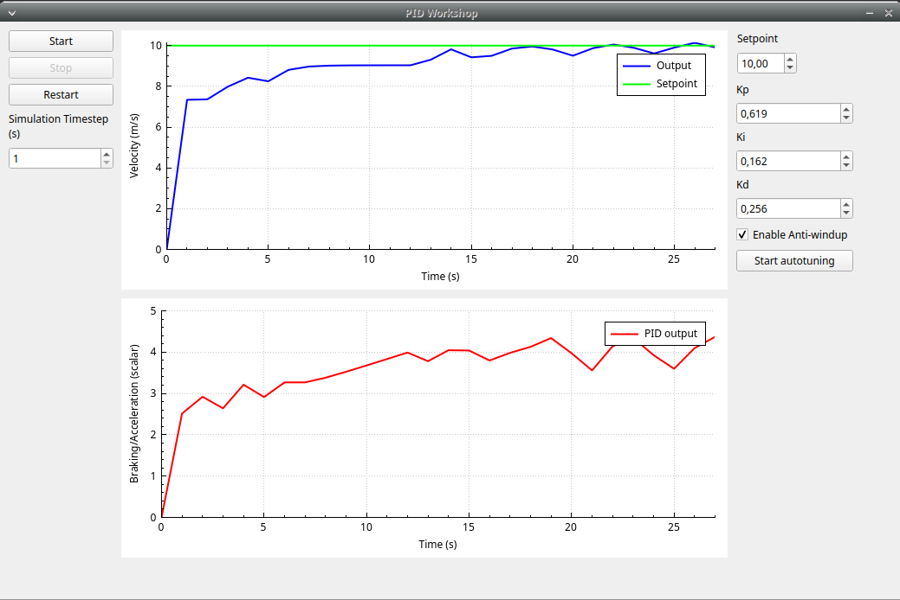

# PID-Workshop
Program for visualising the process of PID tuning and its impact on the controlled plant. Written in Qt framework and C++ language. A car model has been used as a plant, with a cruise control system to adjust in order to maintain a set speed. The program implements a method of automatic selection of PID values by using a metaheuristic method: compact genetic algorithm. 

